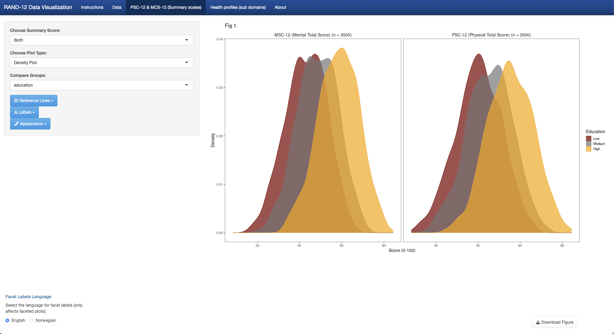
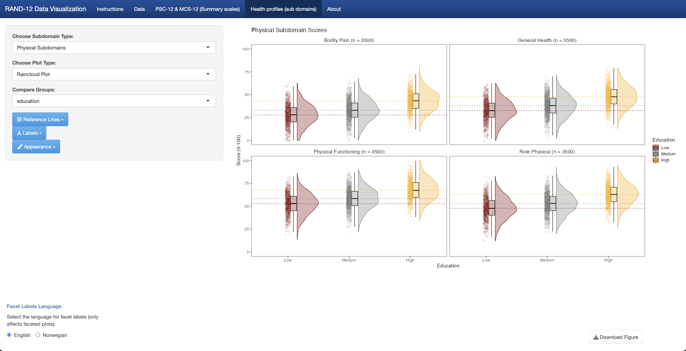

# Shiny.RAND12

<!-- badges: start -->
[](https://doi.org/10.5281/zenodo.15303336)
[](https://github.com/SondreNilsen/Shiny.RAND12/actions/workflows/R-CMD-check.yaml)


<!-- badges: end -->

**RAND-12 Data Visualization Shiny App**

------------------------------------------------------------------------

## Table of Contents

-   [Description](#description)
-   [Installation](#installation)
-   [Usage](#usage)
-   [Features](#features)
-   [Screenshots](#screenshots)
-   [Dependencies](#dependencies)
-   [Citation](#citation)
-   [Issues & Feature Requests](#issues--feature-requests)
-   [License](#license)
-   [Contact](#contact)

------------------------------------------------------------------------

## Description

**Shiny.RAND12** is an R package wrapping a Shiny application for simulating or uploading RAND-12 health survey data and generating publication-quality plots of summary and subdomain scores. It offers flexible plot types, language toggles (English/Norwegian), and one-click figure downloads (PDF/PNG).

------------------------------------------------------------------------

## Installation

Install the development version from GitHub:

``` r
#install.packages("remotes")
remotes::install_github("SondreNilsen/Shiny.RAND12")
```

### 🔒 Installing on Offline or Closed Servers

If you're working on a server without access to GitHub (but with access to CRAN), you can still install the package from a `.tar.gz` source file.

-   Download the `Shiny.RAND12_0.1.0.tar.gz` file from the [Releases page](https://github.com/SondreNilsen/Shiny.RAND12/releases).
-   Install missing CRAN packages, if needed:

```r
required_pkgs <- c(
  "shiny", "shinythemes", "shinyWidgets", "DT", "dplyr", "tidyr", "ggplot2",
  "ggrain", "ggsci", "RColorBrewer", "readr", "readxl", "colourpicker",
  "haven", "pkgload", "rstudioapi"
)

missing <- setdiff(required_pkgs, rownames(installed.packages()))
if (length(missing)) install.packages(missing)
```

- Install the local `.tar.gz` file *(adjust the path as needed)*:

```r
install.packages("/path/to/Shiny.RAND12_0.1.0.tar.gz", repos = NULL, type = "source")
```
------------------------------------------------------------------------

## Usage

``` r
library(Shiny.RAND12)
runRAND12App()
```

------------------------------------------------------------------------

## Web Application

You can also access and run the full Shiny.RAND12 application online (no data is ever stored):

🌐 **https://sondrenilsen.shinyapps.io/ShinyRAND12**

> **Note:** All uploads in this hosted session are ephemeral—nothing is saved on the server.  
> For sensitive data or full control over your files, see [Usage](#usage) to install and run the app locally.

------------------------------------------------------------------------


## Features

### 📂 Data Upload & Preview

-   Built-in simulated RAND-12 data to play around with
-   Import your own data in SPSS (.sav), Stata (.dta), Excel (.xls/.xlsx), or CSV formats\
-   Automatic wide-to-long conversion and factor labeling

### 📊 Summary Scores (PSC-12 & MSC-12) & Subdomain Profiles

Visualize the PSC-12, MSC-12, and Subdomain Profiles with: 
- Histogram, density, boxplot, violin, jitter, raincloud, trend-line (observed, lm, loess) 
- Compare groups by any categorical variables 
- Add mean/median reference lines (grand and by group) 
- Coordinate flips, custom axis limits

### 🎨 Theming & Localization

-   Select from multiple ggplot2 themes and color palettes (qualitative & sequential)\
-   Toggle facet labels and response levels between English and Norwegian\
-   Add facet by group counts to caption
-   Set alpha (transparency), text sizes and more

### 📥 Download Publication-Quality Figures

-   One-click export to PDF or PNG at custom dimensions and resolution

------------------------------------------------------------------------

## Screenshots

- See a few example screenshots in the [`man/figures/`](man/figures/) folder.

<table>
<tr>
  <td align="center">
    <strong>PSC-12 & MSC-12</strong><br/>
    
  </td>
  <td align="center">
    <strong>Subdomain scores</strong><br/>
    
  </td>
</tr>
</table>

------------------------------------------------------------------------

## Dependencies

The package imports these core R packages: shiny, shinythemes, shinyWidgets, ggplot2, dplyr, tidyr, colourpicker, RColorBrewer, ggsci, haven, readxl, readr, DT, ggrain

These are declared in DESCRIPTION under `Imports`: and loaded quietly in the app.

------------------------------------------------------------------------

## Citation

If you use **Shiny.RAND12** in your work, please cite it as:

> Nilsen, S. A. (2025). *Shiny.RAND12: RAND-12 Data Visualization Shiny App* (Version 0.1.0) [Software]. Zenodo. https://doi.org/10.5281/zenodo.15303336

### BibTeX

```bibtex
@Software{Nilsen2025ShinyRAND12,
  author    = {Nilsen, Sondre Aasen},
  title     = {{Shiny.RAND12: RAND-12 Data Visualization Shiny App}},
  version   = {0.1.0},
  year      = {2025},
  publisher = {Zenodo},
  doi       = {10.5281/zenodo.15303336},
  url       = {https://github.com/SondreNilsen/Shiny.RAND12}
}

```
------------------------------------------------------------------------
## Issues & Feature Requests

If you encounter a bug or would like to request a new feature, please open an issue on GitHub:

1. Go to the [Issues tab of this repository](https://github.com/SondreNilsen/Shiny.RAND12/issues)  
2. Click **New issue**  
3. Choose “Bug report” or “Feature request,” fill in the template, and submit

------------------------------------------------------------------------


## License

This project is licensed under the **MIT License** – see the [LICENSE](LICENSE) file for details.

------------------------------------------------------------------------

*Created by Sondre Aasen Nilsen, on behalf of the Center for Patient-Reported Data, Haukeland University Hospital, Bergen, Norway.*

